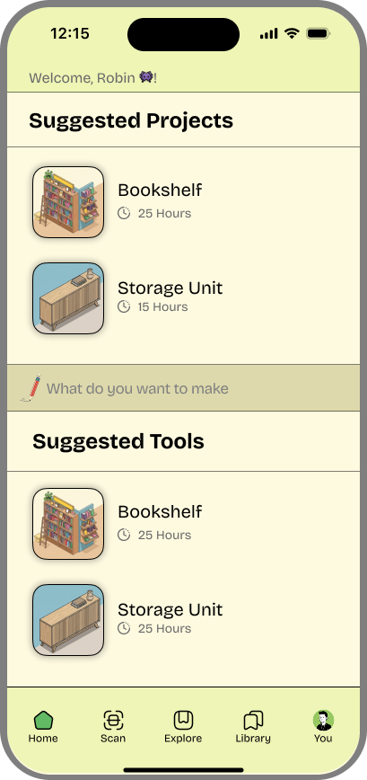
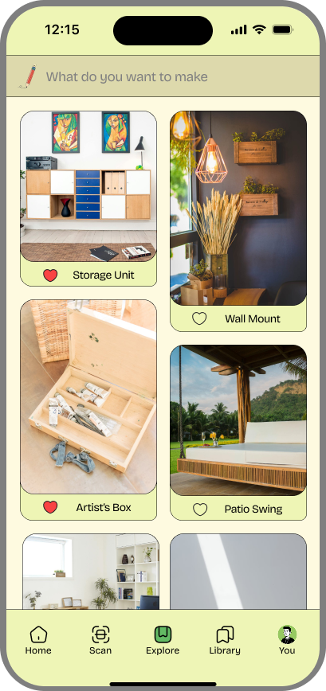
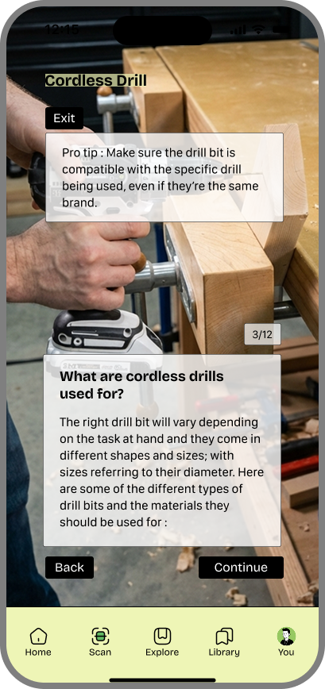

# Makermate — AR Learning for Beginner Makers

**Helping students confidently use workshop tools through safe, guided, real-time learning.**

---

## Overview

Makermate is an educational app designed to help beginner makers understand and safely use workshop tools. By scanning a tool with their phone, students can instantly identify its parts, learn what each component does, and follow simple, guided steps to begin using it.

The goal was to reduce the emotional and cognitive barriers that stop beginners from trying equipment — empowering learners to move from curiosity to hands-on creation.

---

## My Role

### Product Designer (End-to-End)

I led the design process across research, strategy, and execution:

- **User Research & Interviews**
- **Archetype Development**
- **Journey Mapping & Storyboarding**
- **UI/UX Design**
- **Paper Prototyping**
- **Wizard-of-Oz User Testing**
- **High-Fidelity Interaction Design (Figma)**

This project strengthened my ability to blend research, visual design, and rapid prototyping into a cohesive product experience.

---

## Problem Area

Walking into a makerspace can feel overwhelming. Students are surrounded by unfamiliar tools, unclear terminology, and safety procedures they've never been taught. Through research, I found that many students stop at the very first step: approaching a tool they don't understand.

Through early interviews, I heard the same concerns repeated:

> "I don't even know what I'm looking at."

> "I know this tool is safe if you know how to use it… I don't."

> "I don't want to ask staff again — it feels embarrassing."

> "The instructions on the wall are way too long."

These emotional barriers — intimidation, confusion, and fear — became the foundation for Makermate.

---

## Research Approach

To validate the problem and understand the learning context, I conducted:

- **6 interviews** with beginner/intermediate makers
- **1 interview** with a makerspace manager
- **Field observations** during open lab hours
- **Paper prototype tests** simulating AR labeling and steps

This multi-method approach allowed me to observe both what students said and what they did when interacting with tools.

---

## Primary Insights

### 1. Tool intimidation is real

Beginners often freeze simply because they don't know the names or functions of visible parts.

> "I want to use it, but I don't know what anything does."

### 2. Part recognition must come before instruction

Users felt unsafe proceeding when they couldn't identify components like the chuck, trigger, or guard.

### 3. Long instructions overload beginners

Paragraphs were ignored. Students asked for clarity and immediacy.

### 4. Students need fast, independent guidance

They don't want to rely on staff for every forgotten step.

### 5. Confidence is the true barrier

Students weren't incapable — they were unsure.

---

## Secondary Insights

Two additional research streams shaped the direction:

### 1. Makerspace Learning Research

Studies show that makerspace users rely heavily on casual peer observation instead of formal instruction. This validated the need for concise, approachable, in-the-moment guidance.

### 2. AR Learning Literature

AR improves comprehension when teaching complex physical systems because it grounds learning directly on the object. This supported using AR-style part identification as the first step.

---

## Archetypes

### The Hesitant Hare

> "I'm scared I'll mess up or get hurt."

**Needs:**
- Gentle, non-intimidating guidance
- A sense of psychological and physical safety
- Simple explanations before action

**Behaviors:**
- Avoids tools due to unfamiliarity
- Enters the workshop only when required
- Freezes around unclear components

**Opportunities:**
- AR part labeling to reduce fear
- Friendly tone to increase reassurance
- Clear, gradual steps

---

### The Frustrated Beaver

> "Why am I waiting for help? I could figure this out."

**Needs:**
- Fast, on-demand information
- Independence from staff availability
- Clear instructions to begin immediately

**Behaviors:**
- Gives up when instructors are busy
- Tries to troubleshoot but lacks key info

**Opportunities:**
- Scan-based instant guidance
- Structured yet quick steps
- Actionable flows that support initiative

---

## Design Solution

Makermate identifies tools, labels their parts, and teaches students through short, confidence-boosting steps.

The app helps students transition from **hesitation → clarity → action → creation**.

---

## Early Prototyping

I began with paper prototypes to test the core flows:

- Simulated tool scanning
- AR-style part labels
- One-sentence guided steps
- A clear "Start Learning" entry point

Using a Wizard-of-Oz method, participants interacted as if using a real AR app while I triggered responses behind the scenes.

**Participants:** 3–4 beginner makers, ages 18–25.

---

## Testing Insights

### 1. Students needed a clear entry point

They hesitated until they saw a button like "Start Learning".

### 2. Part labeling was the most valuable feature

Recognition immediately reduced anxiety.

### 3. One-sentence steps improved comprehension

Users could act quickly without re-reading instructions.

### 4. Realistic visuals built trust

Stylized graphics caused confusion — users preferred real photos.

### 5. Students wanted personalization

They asked for a way to save tools, ideas, and projects.

---

## Design Decisions

### 1. Replace long text with simple, one-sentence steps

This drastically reduced cognitive load.

### 2. Introduce part labeling before any tutorial

Users needed orientation first, actions second.

### 3. Add a tool gallery for exploration & inspiration

This supports ongoing learning, not just task completion.

### 4. Use realistic visuals instead of stylized graphics

Visual grounding increased user trust and accuracy.

These decisions aligned the experience with the emotional arc of learning:

**Recognition → Orientation → Action → Confidence**

---

## User Journey Learnings

The biggest friction comes **before** interacting with the tool.

Students must first understand:

- What they're looking at
- Which parts matter
- How the tool safely begins

Once confidence rises, the journey flows smoothly into learning and building.

---

## Final Prototype

The final Figma prototype delivers a cohesive, intuitive learning flow that brings all research insights together.

### What the final prototype includes:

#### 1. "Scan to Begin" Entry Point

A welcoming, uncluttered start screen that helps reduce hesitation.

#### 2. Tool Identification Screen

A confirmation moment that grounds users before learning begins.

#### 3. AR-Style Part Identification

Floating labels highlight essential parts like the:

- Chuck
- Trigger
- Speed selector
- Bit
- Grip

This step removes unfamiliar terminology as a barrier.

#### 4. One-Sentence Guided Steps

Users swipe through simple, actionable steps such as:

- "Insert the drill bit into the chuck."
- "Tighten the chuck until secure."
- "Set the speed to low before starting."
- "Hold steady and drill to depth."

Every step is designed for clarity, confidence, and safety.

### Prototype Screens

| | | |
|:---:|:---:|:---:|
|  |  |  |
| **Home** | **Discovery** | **New Tool** |
|  |  |  |
| **Scan** | **Scan 2** | **Scan 3** |

---

## Reflection

### What I Would Do Next

With more time and resources, I would:

- Build a functional AR prototype in Unity
- Test with real tools inside the makerspace
- Expand the tool library (bandsaw, drill press, sander)
- Add personalized project pathways
- Explore real-time overlays during tool operation

### What Failed — and What It Taught Me

**Long instructions:**
Users skipped them → Clarity is everything.

**Stylized graphics:**
They didn't match real tools → Visual grounding matters.

**Overambitious AR vision at first:**
Not technically feasible early on → Balance ambition with reality.

### What I Learned

Makermate taught me the value of designing across research, technology, and narrative. Most importantly, it taught me that:

- **Confidence is a design outcome.**
- A well-designed experience can transform fear into capability.
- AR should be used with intention, not spectacle.
- Anchoring information in context can dramatically improve comprehension.
- **Design is emotional.**

A learner's confidence arc is as important as the interface itself — "vibecoding" can't manufacture feelings; only intentional design can.

---

## Final Thoughts

Makermate is more than a tool-learning app — it's a bridge between curiosity and creation. By meeting students in the moment of hesitation and guiding them gently forward, it makes the workshop feel more approachable, inclusive, and empowering.

---

*Case Study by Anuj Bhandare*  
*MA Interaction Design and Interactive Art*  
*Tools: Figma, Paper Prototyping, User Interviews, Wizard-of-Oz Testing*

